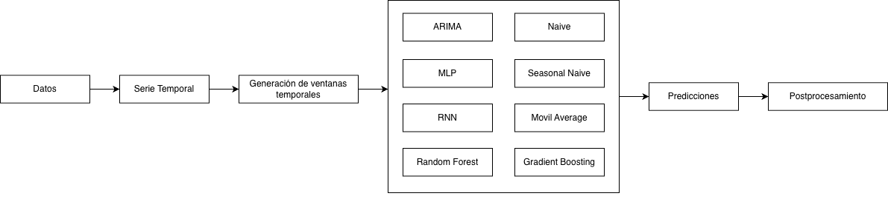
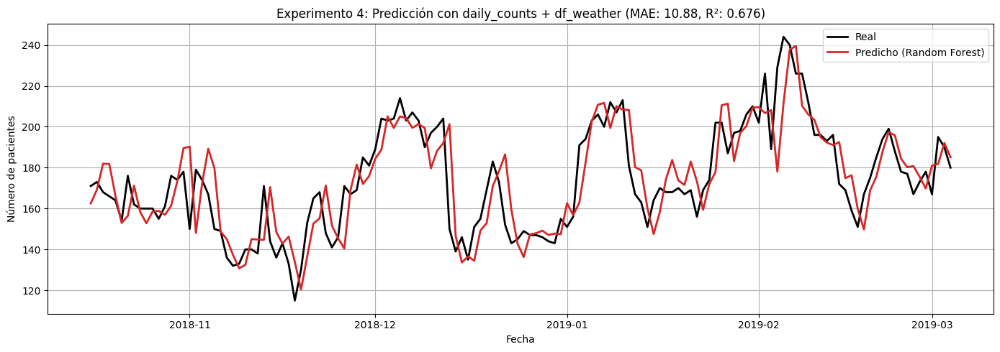

# Predicción de la Ocupación Diaria de Camas Hospitalarias

## Descripción general

Este proyecto desarrolla un sistema de _forecasting_ capaz de predecir la **ocupación diaria de camas hospitalarias** con un horizonte de **7 días**, utilizando modelos estadísticos, métodos basados en árboles y redes neuronales.

Incluye todo el _pipeline_:

-   procesamiento de datos crudos de hospitalizaciones,
-   construcción de series temporales,
-   ingeniería de variables exógenas (clima, calendario, etc.),
-   generación de ventanas,
-   entrenamiento, validación y comparación de modelos,
-   análisis de resultados y métricas.

El objetivo es **anticipar aumentos abruptos en la demanda hospitalaria** para mejorar la planificación de recursos críticos (personal, UTI, equipamiento).

## Acerca de los datos

El dataset utilizado proviene de los registros individuales de admisión y alta de pacientes del Hero DMC Heart Institute (Ludhiana, India), correspondientes al período 2017–2019.

### Construcción de la serie temporal

A partir de los registros individuales, construimos una serie temporal agregada día por día, donde cada punto representa el número total de pacientes hospitalizados en esa fecha.
Este proceso incluye:

1. Convertir las fechas de admisión/alta en rangos de ocupación

2. Expandir cada internación a todos los días que abarca

3. Contabilizar el total de personas internadas por día

4. Unificar la señal en una serie continua sin días faltantes

Esto transforma datos orientados a eventos en un dataset apto para técnicas de forecasting.

### Variables exógenas

Además, se incorporaron variables externas para enriquecer la señal:

-   Temperatura

-   Humedad

-   Índices de calidad del aire (AQI)

-   Calendario (día de la semana, feriados, estacionalidad)

## Modelos evaluados

-   Modelos ingenuos

    -   Naive
    -   Seasonal Naive
    -   Moving Average

-   Modelos estadisticos

    -   Ariama

-   Modelos basados en árboles

    -   Random Forest
    -   Gradient Boosting

-   Redes Neuronales
    -   MLP
    -   RNN

  

## Predicción vs serie real (mejor modelo):

  

